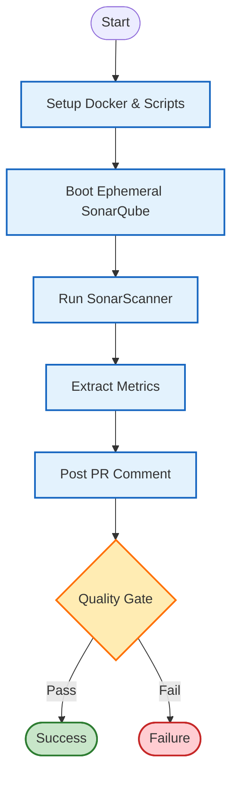

# SonarLess Scan

This GitHub Action performs a **SonarQube analysis** on your code using an **ephemeral, self-contained SonarQube server**.

Instead of relying on a strictly managed, permanent, and often expensive external SonarQube instance, this action spins up a lightweight SonarQube server (Community Edition) directly within the GitHub Runner, runs the scan, extracts the results, and then tears it down.

## Why use this?

*   **Zero Infrastructure**: No need to pay for or host a permanent SonarQube server.
*   **Self-Contained**: The definition of "Quality" travels with the code (in the JSON file).
*   **Instant Feedback**: You get the full power of SonarQube analysis in your PRs without external dependencies.

## Workflow



## Default Quality Gate

The quality gate is defined in `scripts/quality-gate.json`. The default thresholds are:

*   **Vulnerabilities**: 0
*   **Bugs**: 0
*   **Code Smells**: 20
*   **Duplicates**: 20
*   **Complexity**: 20

If any of these thresholds are exceeded, the workflow will **Fail**.

## Inputs

| Input | Description | Default |
| :--- | :--- | :--- |
| `sonar-project-name` | Project Name in SonarQube | Repository Name |
| `sonar-project-key` | Project Key in SonarQube | Repository Name |
| `sonar-source-path` | Path to source code | `src` |
| `sonar-metrics-path` | File to save metrics to | `./sonar-metrics.json` |
| `is-sonar-metrics-upload` | Upload `sonar-metrics.json` as artifact | `true` |
| `github-token` | GitHub Token for PR comments | `${{ github.token }}` |
| `dotnet-build-command` | Build command for .NET projects | `""` |

## Usage

### Standard Scan
```yaml
jobs:
  sonar-scan:
    runs-on: ubuntu-latest
    steps:
      - uses: actions/checkout@v4
      - name: SonarLess Scan
        uses: BakeFoundry/bk-sonar-scan-workflow@v1
        with:
          sonar-source-path: "."
```
